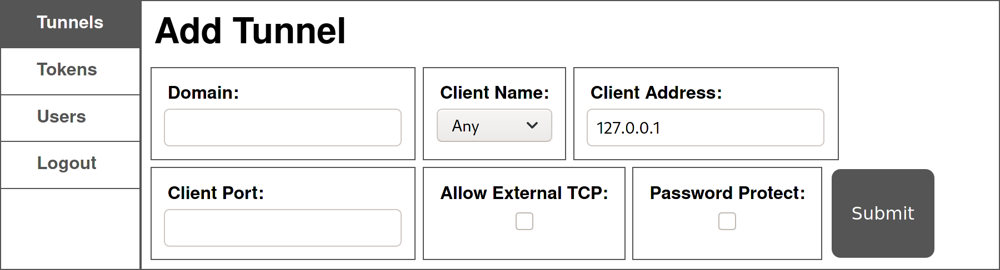

# Usage

`boringproxy` consists of two kinds of long running processes that act as server and client.

Run it in the shell, with `bg`/`fg`, in a tmux session, or configure a system daemon.

It is managed via an administrative web interface.

---

## Command line interface

The command line interface is used to create server and client instances.

## Server

The server requires you to pass the domain it will serve. It is invoked with:

> `./boringproxy server -admin-domain <admin-domain>`

> `-admin-domain` - the main domain configured in DNS

Example:

```
boringproxy server -admin-domain bpdemo.brng.pro
```

Upon first run a simple text database file `boringproxy_db.json` with admin credentials will be created and a login link is displayed that looks like:

> `https://<FQDN>/login?access_token=<TOKEN>`

Example:

```
https://bpdemo.brng.pro/login?access_token=yJaicLl6zj48zZItXvtQGb4CH5m5fId5
```

## Client

The client needs to know which server to connect to, a valid combination of user and access token plus a unique name for the current client. You can start it with:

```bash
./boringproxy client \
    -server <server> -user <user> -token <token> -client-name <client-name>
```

> `-server` - the domain of the remote server  
> `-user` - username, min. six characters, if not admin  
> `-token` - access token to authenticate against the service  
> `-client-name` - identifier for the client, used in the interface to distinguish the available tunnel origins  

Example:

```
boringproxy client \
    -server bpdemo.brng.pro \
    -token fKFIjefKDFLEFijKDFJKELJF \
    -client-name demo-client \
    -user demo-user
```

---

## Web interface

The web interface is used to manage users, access tokens and tunnels.

Access it at `https://<FQDN>/` where you will be presented with a prompt for a token, or with the direct login link from above.

> 
>
> Web interface after logging in as admin.

### Tunnels

The tunnels pane allows creating and removing tunnels. It provides a way for you to specify the settings of a tunnel:

* **Domain**  
  The FQDN of a domain pointing at the `boringproxy` server. With DNS wildcard setup, this can be any subdomain of the `admin-domain`. You must insert the **full domain** that you want the tunnel to be accessed from, not just the subdomain. For example, if you had a wildcard DNS record `*bpdemo.brng.pro` pointing to your boringproxy server, and you wanted a media server to be accessed at `media.bpdemo.brng.pro`, you would have to insert `media.bpdemo.brng.pro` to this field.
* **Client Name**  
  Choose a connected client as tunnel partner
* **Client Address**  
  The forwarding target as seen from the client
* **Client Port**  
  The port forwarding to
* **Allow External TCP**  
  Enable raw TCP tunneling for other protocols than HTTP
* **Password Protect**  
  Enable to set username and password for HTTP basic auth

### Tokens

The tokens pane allows to create and remove tokens for your currently logged in user.  
Multiple tokens per user can be issued.  
Administrators can manage the tokens of all users.

### Users

The users pane allows users with administrative priviledge to add and remove users.

---

## HTTP API

There is an experimental HTTP API, that is being used internally by the web interface. Authentication details and routes will become available when its public interface stabilises.
